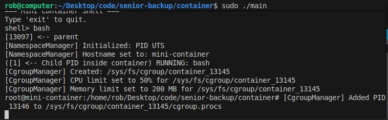

# What Happens at Runtime
```
Parent
 └─> fork()
      └─> Child (Namespace + Manager)
           ├─ unshare(CLONE_NEWPID | CLONE_NEWUTS)
           ├─ sethostname("mini-container")
           ├─ fork() -> inner_pid
           │    └─> Inner Child (Containerized process)
           │         └─ runs "bash", "ls", etc.
           └─> CgroupManager
                ├─ creates /sys/fs/cgroup/container_<pid>
                ├─ sets cpu.max, memory.max
                └─ writes inner_pid to cgroup.procs

```
# Test
```
g++ -std=c++17 main.cpp -o mini_container
sudo ./mini_container
```
